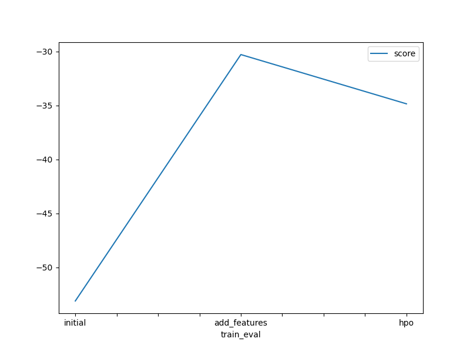
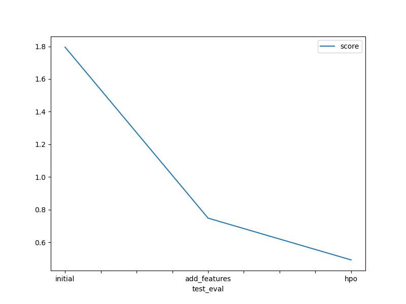

# Report: Predict Bike Sharing Demand with AutoGluon Solution
#### Mohamed A. Hedeya

## Initial Training
### What did you realize when you tried to submit your predictions? What changes were needed to the output of the predictor to submit your results?
I had to take care of any predictions that are less than zero. I had to set any less-than-zero predictions to zero before submission.

### What was the top ranked model that performed?
WeightedEnsemble_L3

## Exploratory data analysis and feature creation
### What did the exploratory analysis find and how did you add additional features?
I extracted the 'hour' from the 'datetime' feature. In addition, I added temperature, windspeed, and humidity categories.

### How much better did your model preform after adding additional features and why do you think that is?
The score improved a lot (from 1.79543 to 0.74773)

## Hyper parameter tuning
### How much better did your model preform after trying different hyper parameters?
The score improved from 1.79543 to 0.49168

### If you were given more time with this dataset, where do you think you would spend more time?
Exploring more hyper parameters to try to fine tune better

### Create a table with the models you ran, the hyperparameters modified, and the kaggle score.
|model|hpo1|hpo2|time_limit|score|
|--|--|--|--|--|
|initial|defalut vals|defalut vals|600|1.79543|
|add_features|defalut vals|defalut vals|600|0.74773|
|hpo|'CAT': {'iterations': 10000}|'GBM': {'num_boost_round': 100, 'num_leaves': ag.space.Int(lower=26, upper=66, default=36)}|1500|0.49168|

### Create a line plot showing the top model score for the three (or more) training runs during the project.

### Create a line plot showing the top kaggle score for the three (or more) prediction submissions during the project.

## Summary
|model|hpo1|hpo2|time_limit|score|
|--|--|--|--|--|
|initial|defalut vals|defalut vals|600|1.79543|
|add_features|defalut vals|defalut vals|600|0.74773|
|hpo|'CAT': {'iterations': 10000}|'GBM': {'num_boost_round': 100, 'num_leaves': ag.space.Int(lower=26, upper=66, default=36)}|1500|0.49168|